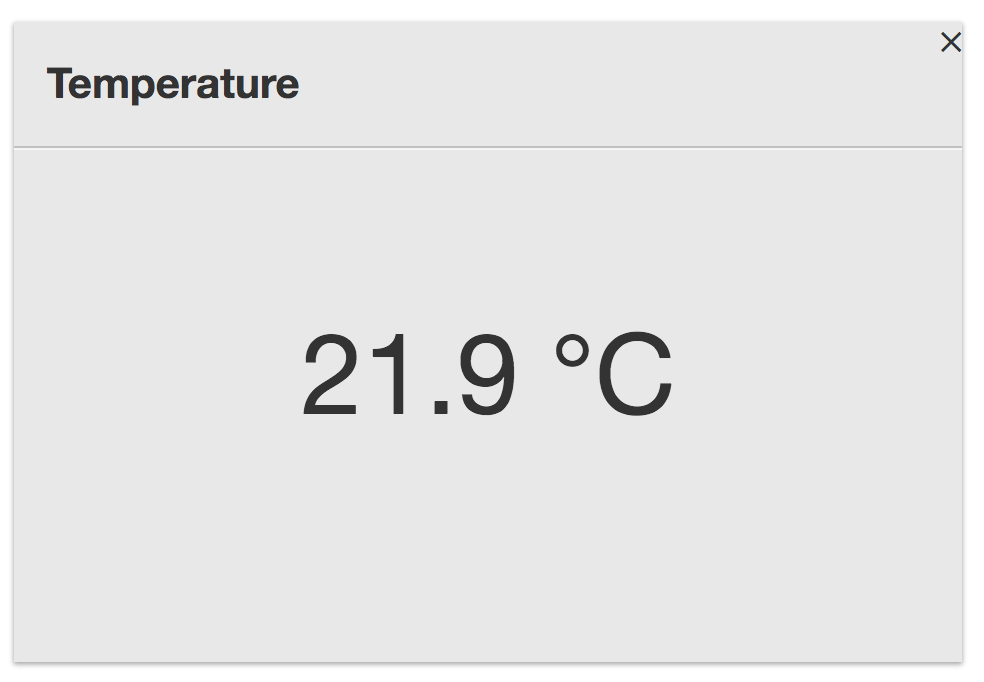
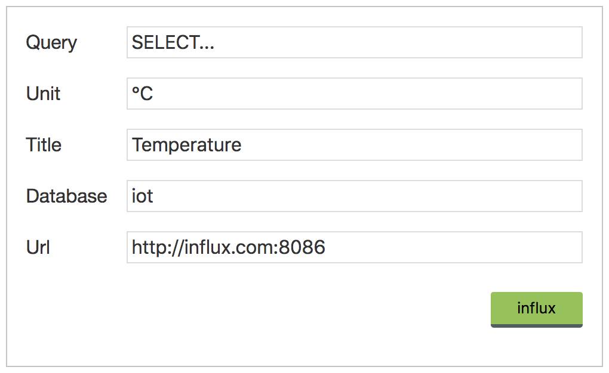

# Frontpage Plugin - Influx

This plugin shows the latest single state of a [InfluxDB](https://docs.influxdata.com/influxdb/v1.5/) Query in the [CoffeeNet Frontpage](https://github.com/coffeenet/coffeenet-frontpage). e.g. 
Temperature

## Configuration

Currently no authentication for the InfluxDB-Instance is possible. 

